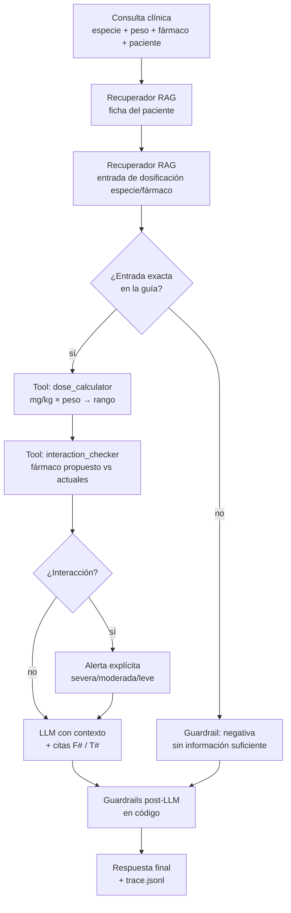

# EP1 — Agente de Dosis Seguras para Clínica Veterinaria

**ISY0101 · Ingeniería de Soluciones con IA · Evaluación Parcial 1 (30%)**

Agente LLM + RAG que asiste a una clínica veterinaria pequeña (sin
especialista de respaldo): recupera la ficha del paciente y la guía de
dosificación, calcula el rango seguro según peso, verifica interacciones con
los medicamentos actuales y responde citando la fuente exacta. **Nunca
sugiere una dosis sin fuente**: si el dato no existe para esa especie/fármaco,
responde "no tengo información suficiente"; si hay interacción, emite alerta
explícita.

> **Estado:** Fases 0–6 completas. Suite de tests 11/11, evals 14/14 casos
> (100%, meta ≥85%). Decisiones técnicas y bitácora en
> [`agents.md`](agents.md).

## Pipeline (loop razonamiento-acción)



Cada paso queda registrado en `logs/trace.jsonl` (JSONL con paso, tipo de
evento y hora UTC): trazabilidad completa de qué fuente se usó y qué
herramienta se ejecutó.

## Datos

| Colección | Origen | Contenido |
|---|---|---|
| Interna (RAG 1) | `data/internal/fichas/` | 12 fichas clínicas FIC-001..012 (5 perro, 4 gato, 3 conejo): peso, edad, medicamentos actuales, alergias |
| Externa (RAG 2) | `data/external/dosificacion/` | 18 entradas DOS-001..018 (7 perro, 6 gato, 5 conejo): mg/kg min-max, frecuencia, vía, fuente bibliográfica |
| Tools | `data/external/interacciones.json` | 8 pares de fármacos con severidad (severa/moderada/leve) y nota clínica |

Incluye **huecos deliberados** (p. ej. carprofeno-gato, amoxicilina-conejo) para
probar el guardrail de negativa: el agente debe decir "no tengo información
suficiente" en vez de inventar una cifra.

## Cómo correr

```bash
uv sync
cp .env.example .env   # pegar GROQ_API_KEY (gratis) de https://console.groq.com

# 1. Ingesta a ChromaDB (30 documentos, verificación semántica incluida)
uv run python -m ingestion.ingest

# 2. CLI con el LLM real (Groq)
uv run python main.py "perro con dolor articular que ya toma meloxicam" \
    --especie perro --peso 24.5 --farmaco carprofeno --paciente FIC-001 --pasos

# 3. CLI determinista (ClienteFalso, sin API key) para demo/CI
uv run python main.py "gata que ya toma carprofeno" \
    --especie gato --peso 5.8 --farmaco carprofeno --paciente FIC-005 --falso

# 4. Tests y evals
uv run python -m pytest -q
uv run python -m tests.eval_agent
```

Notebook de demostración con 4 casos (alerta severa, dosis normal, negativa
sin fuente, alerta moderada): `notebooks/demo.ipynb`.

## Guardrails de seguridad (Fase 4, en código)

Verificación post-LLM en `agent/reasoning_loop.py`, no solo en el prompt:

1. **Negativa sin fuente:** si no existe entrada exacta especie/fármaco en la
   guía, el texto del LLM se **reemplaza** por una negativa estándar sin
   cifras (`negativa_sin_informacion` en trace).
2. **Alerta severa anteponida:** si hay interacción severa, se antepone un
   encabezado `ALERTA DE INTERACCION SEVERA...` con la nota clínica y la
   advertencia de no administrar sin supervisión (`alerta_severa_anteponida`).

## Evals (Fase 5)

`tests/eval_dataset.json` con 14 casos: cálculo de dosis por especie/peso,
alertas severas (AINE+AINE, AINE+corticosteroide), moderadas y leves,
negativas por dato inexistente y verificación de citas. Corre con
`ClienteFalso` (reproducible, sin cuota de API):

```
Evals: 14/14 casos OK (100%) | meta >= 85%
```

## Limitaciones

- La guía de dosificación es un dataset curado de referencia para el prototipo
  (fuente citada en cada entrada); NO sustituye a Plumb's Veterinary Drug
  Handbook ni a la ficha técnica vigente. La salida es apoyo para un
  veterinario, no una prescripción.
- Cuota Groq (200k tokens/día): usar `GROQ_MODEL_FAST` (20b) en dev y evals.
